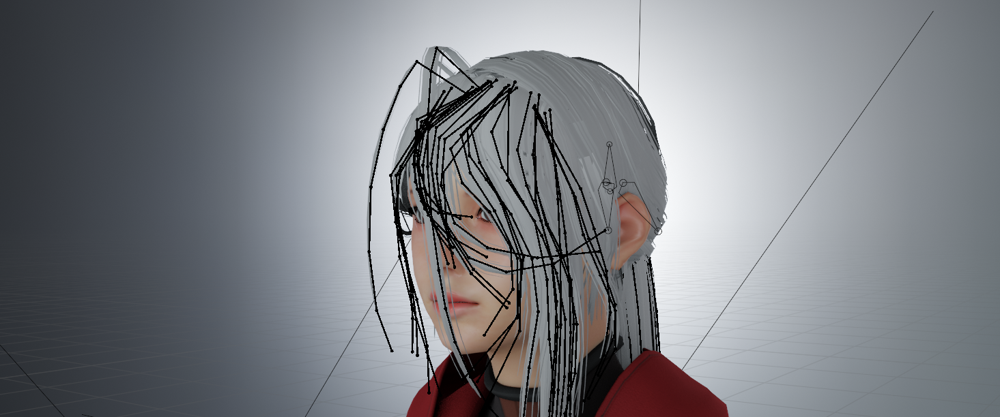
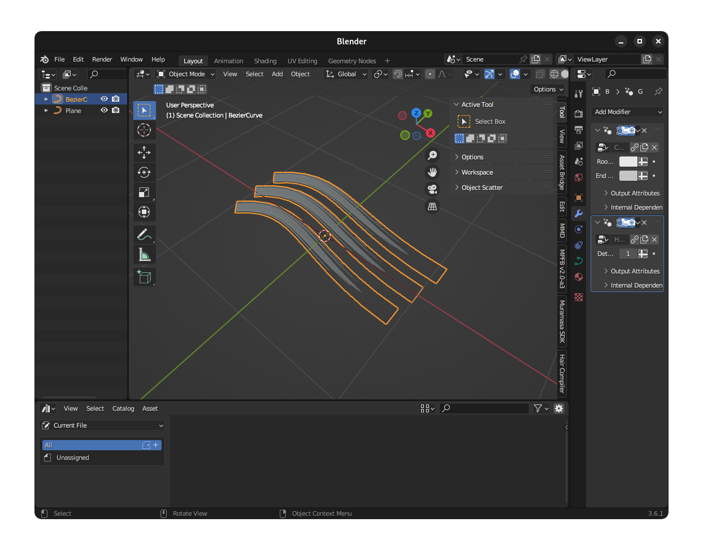
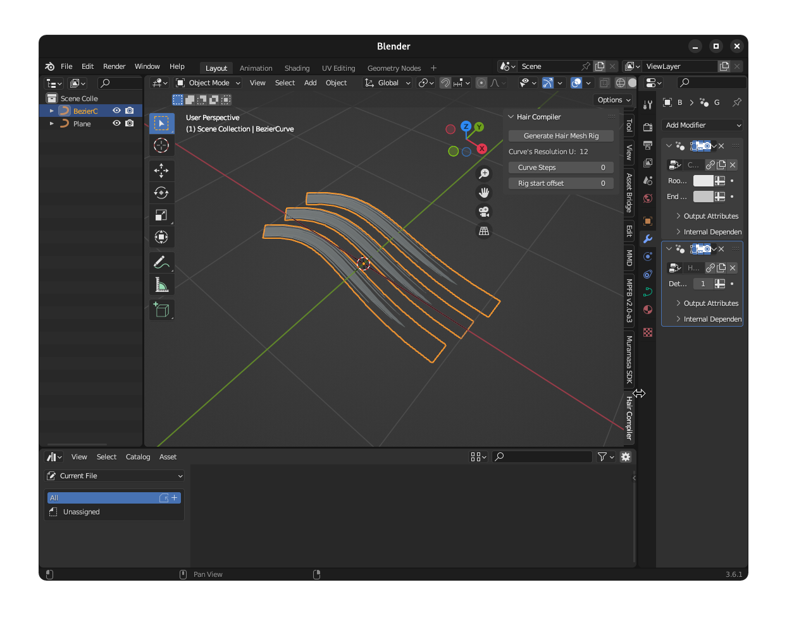
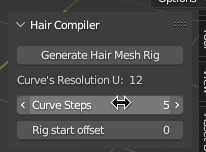
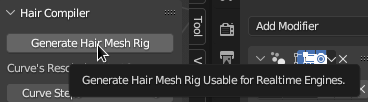
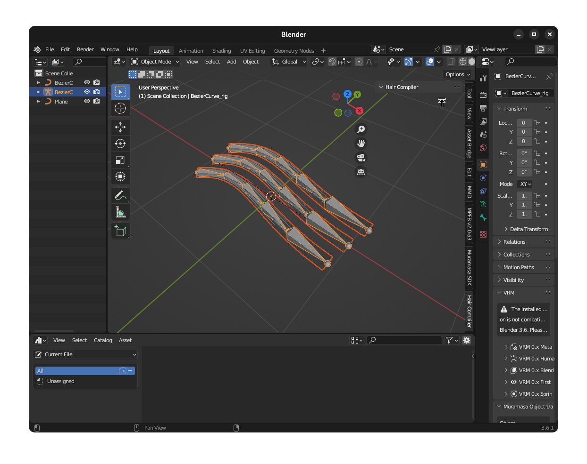
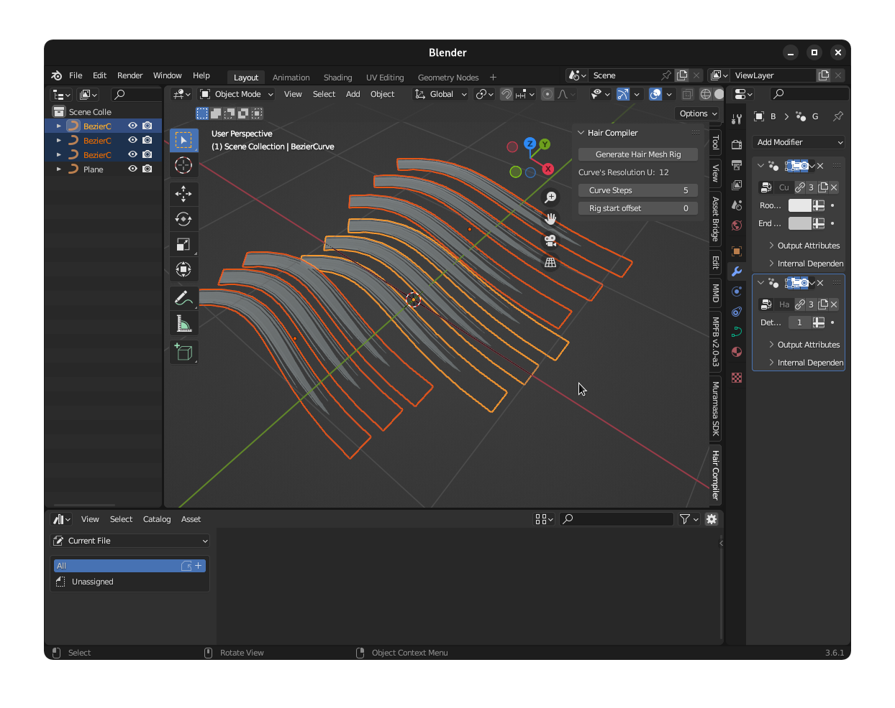
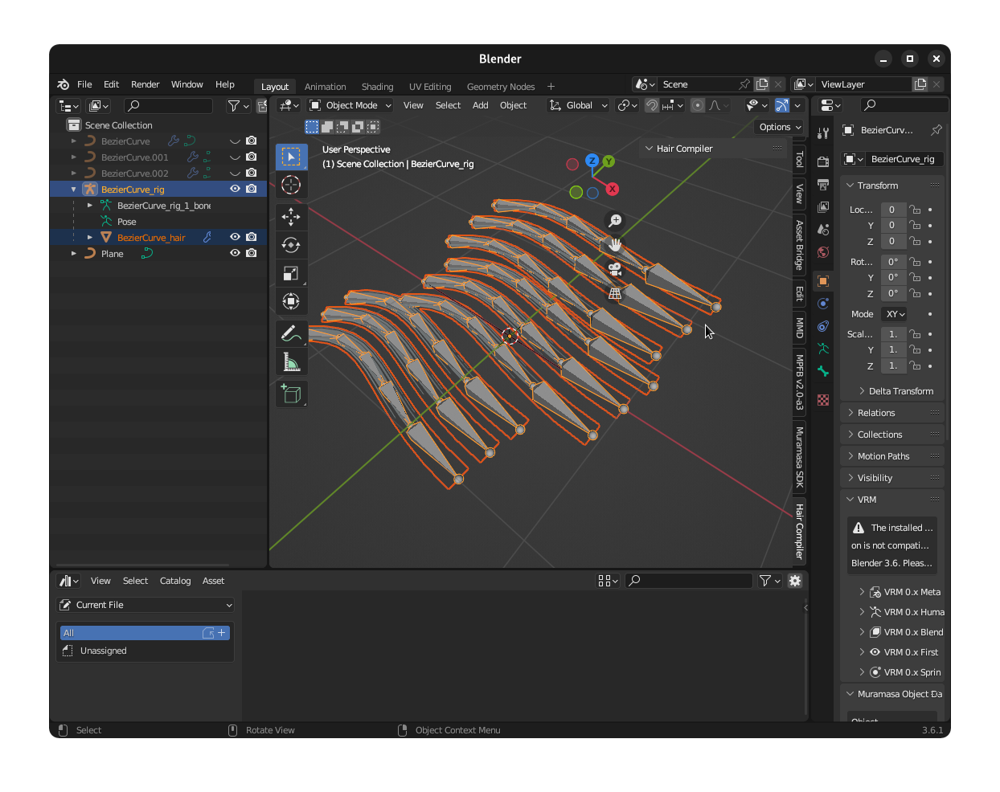

# Hair-Compiler
Blender addon to convert hair-card curves to ready made rigged hair mesh for realtime engines.

## How to install

### 1. Normal Install

Download by going over to the **Releases** section just on the right pane of this webpage.

And then open Blender > User Preferences > Add-ons > Install, go to the zip file you've downloaded from this page.

After that you can search `Hair Compiler` or go through the `Rigging` section of the add-on list.

### 2. Git Install

Make sure you have git installed on your pc, do a `git clone https://github.com/megumumpkin/Hair-Compiler` to the folder where Blender [stores your addon](https://docs.blender.org/manual/en/latest/advanced/blender_directory_layout.html).

After that you can search `Hair Compiler` or go through the `Rigging` section of the add-on list.

With git install you can update the addon by doing git pull inside the cloned folder, and also set the specific commit version which works for you.

### Where can I find the addon?

You can find them in the right sidebar of the 3D View

## Usage

1. Get yourself a hair card curve

2. Open the HairCompiler panel

3. Set the values of the `Curve Steps` for the number of generated bones per curve, if you want to skip parts of the bone to make it a root static you can increase the `Rig Start Offset` value to bigger than one.

4. Press generate

5. Done

You can select multiple hair curve objects and press generate to build and combine them into one mesh and one armature, make sure each individual curve object Hair Compiler's property value has been set. (And make sure to apply all transforms on those three curve objects!)

## Additional notes
This addon will preserve your original curve object to make sure further tweaks that you need to be done by curve object can be done easily.